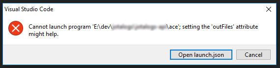

For Node.js developers, there isn't alot of options if you are looking for a full featured MVC framework, but there is one that i've been expirementing with lately, [AdonisJs](https://adonisjs.com/).

AdonisJs offers a wide range of functionality and a whole family/suite of official and complimenting packages, such as its command line tool [Ace](https://adonisjs.com/docs/4.1/ace), and its test framework [Japa](https://github.com/thetutlage/japa).

With its growing ecosystem of official and user written packages, AdonisJS is looking to be one of the most fully featured, but opinionated frameworks available to Node.js developers today. Along with AdonisJS's being a full feature framework, the framework should feel very familiar to developers coming from PHP and Laravel, as AdonisJS appears to be heavily inspired by Laravel.

However, for Node.js developers who have been working in more minimal frameworks such as Express or Koa, myself included, I have found that there can be some friction with breaking away from our preconcived notions for how the framework should work, or how our existing tools and processes should work with the framework.

The most recent pain point I experienced with this has been trying to use vscode to debug my application and its test suite (written using Japa), as I have historically used [Mocha](https://mochajs.org/), which has great support in rich development environments and IDEs such as Intellij Idea and Microsoft Virtual Studio Code.

So what needs to be done to get debugging of your AdonisJS application working with vscode? Not a whole lot actually, its just more than you would have to do if you were using Mocha.

## Debugging your application

I have found that debugging a AdonisJS application with vscode to be relatively easy to setup, and a much better development experience compared to examining log output.

### 1) Register a dev script with npm

In your projects package.json, add a new entry to the scripts object with the value of `adonis serve --dev --debug`. This script can be named however you'd like, but I typically name my development script `dev`.

```json
{
  "scripts": {
    "dev": "adonis serve --dev --debug",
  }
}
```

The above script when executed with `npm run dev` will invoke adonis and by passing the `--dev` and `--debug` flags, instruct Ace to begin watching files for changes, as well as start the node debugger on the default port.

### 2) Create a new launch configuration

Now that you have your npm script registered, you will need to create a new [launch configuration](https://code.visualstudio.com/docs/editor/debugging#_launch-configurations) in vscode that will allow you to invoke your `npm run dev` script, as well as attach to the node inspector.

```json
{
  "version": "0.2.0",
  "configurations": [
    {
      "type": "node",
      "request": "launch",
      "name": "Debug Application",
      "runtimeExecutable": "npm",
      "runtimeArgs": [
        "run",
        "dev"
      ],
      "port": 9229,
      "internalConsoleOptions": "openOnSessionStart"
    }
  ]
}

```

You can now launch your application, set breakpoints, and more, as described in the [vscode documentation](https://code.visualstudio.com/docs/editor/debugging).

## Debugging Tests

### 1) Create a ace.js file

Every AdonisJS project comes with an `ace` file by default. The `ace` file is essentially a configuration file that the AdonisJS command line uses to bootstrap itself and execute commands in a manner that is contextual to your specific application.

A bare bones `ace` file will look something like below:

```javascript
'use strict'

/*
|--------------------------------------------------------------------------
| Ace Commands
|--------------------------------------------------------------------------
|
| The ace file is just a regular Javascript file but with no extension. You
| can call `node ace` followed by the command name and it just works.
|
| Also you can use `adonis` followed by the command name, since the adonis
| global proxy all the ace commands.
|
*/

const { Ignitor } = require('@adonisjs/ignitor')

new Ignitor(require('@adonisjs/fold'))
  .appRoot(__dirname)
  .fireAce()
  .catch(console.error)
```

For reasons that are unknown to me, this file is named `ace` rather than `ace.js` by default, and this unfortunately causes vscode to complain that it cannot find the file when trying to invoke it with node in a launch configuration.



To overcome this, we can rely on the ability for Node.js to require a file and attempt to interpret it as Javascript, regardless of its extension. This allows us to create a `ace.js` file in our project that simply requires the `ace` file.

```js
require('./ace');
```

### 2) Create a new launch configuration

Once you have your `ace.js` file created, you can go ahead want to create a new vscode [launch configuration](https://code.visualstudio.com/docs/editor/debugging#_launch-configurations) entry. If you created a launch configuration entry from the above section, you can simple add your new entry to the configrations array.


```json
{
  "version": "0.2.0",
  "configurations": [
    {
      "type": "node",
      "request": "launch",
      "name": "Debug Application",
      "runtimeExecutable": "npm",
      "runtimeArgs": [
        "run",
        "dev"
      ],
      "port": 9229,
      "internalConsoleOptions": "openOnSessionStart"
    },
    {
      "type": "node",
      "request": "launch",
      "name": "Debug Tests",
      "program": "${workspaceFolder}/ace.js",
      "args": [
        "test"
      ],
      "internalConsoleOptions": "openOnSessionStart"
    }
  ]
}
```

With your `ace.js` file created, and your new Debug Tests launch configuration, you can now use the full power of the vscode debugger to step through your code and your tests in your AdonisJS applcation.

If you found this information useful, or if you've found a better way debug your AddonisJS application and tests, drop me a line over on [Twitter](https://twitter.com/vigs072), or leave a comment below.

Cheers!