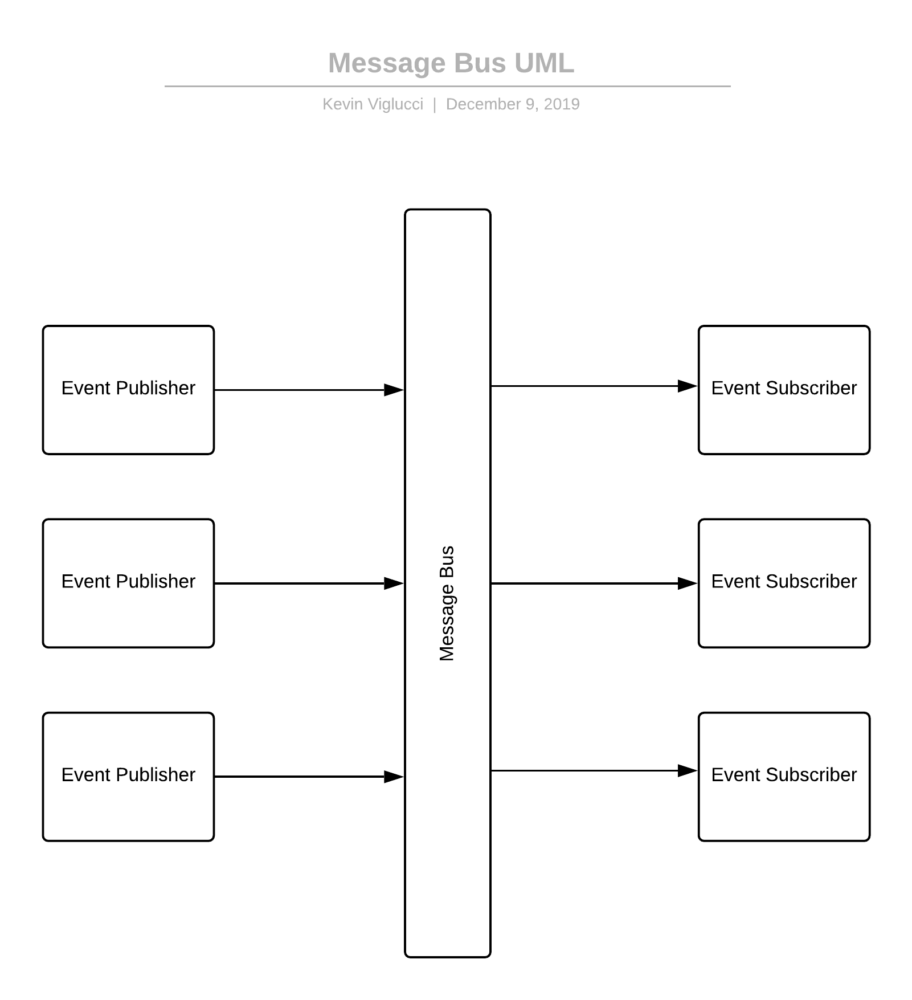

Real-time reactive systems are some of my favorite types of systems to build; however, they can be daunting tasks to approach, especially when learning a new programming language or ecosystem along the way. This notion was recently reinforced for me as I set out to build a "simple" real-time client/server application utilizing Javascript/React & Java/Spring,  where I quickly learned of several new messaging protocols (Stomp & RSocket).

Apart from serving as an exercise in [Cunningham's Law](https://meta.wikimedia.org/wiki/Cunningham%27s_Law), this article aims to expedite the start of your real-time distributed system research and save you some of the time investment that I have already spent scouring the internet, and [screaming into the void on Twitter](https://twitter.com/vigs072/status/1169987607008296960).

**What should you expect from this article?**

This article serves as a high-level overview of topics related to building real-time/distributed systems using several common patterns, ultimately providing a high-level overview of the RSocket protocol. The goal of this article is not to provide fully working complete code samples or in-depth deep dive into any one topic. Instead, this article aims to guide the reader with understanding the common terminology and concepts so that they can more easily gather a more in-depth understanding as they continue their research elsewhere.

## What is a distributed system?

Distributed systems possess a core characteristic in that a network boundary separates the individual system components. Additionally, in a real-time distributed system, each component reacts to changes as they happen across the system topology, automatically, without existing a requirement for components of the system to keep tabs on or regularly check with other parts of the systems to see if something has changed. Implementing such a system using primarily stateless communication protocols such as HTTP is generally considered bad practice, as it quickly leads to implementations that rely on wasteful polling techniques. However, there exist numerous patterns to overcome the wasteful characteristics of HTTP polling.

Some common patterns you may see today include Webhooks, Messaging systems (Buses, Brokers, & Queues), and duplex data streams implemented using a persistent connection protocol such as TCP, WebSockets, and less commonly Aeron.

### Webhooks

The implementation of webhooks may be one of the easiest to understand, as well as to implement (as a consumer), as it is no more complicated than adding an HTTP route handler to your application (the consumer) and accepting HTTP requests from event publishers.

At the core of this pattern is the agreement between publishers and consumers that when a specific event occurs, a publisher agrees to execute an HTTP request against an endpoint implemented on the consumer application, and potentially include with each request some data.

Once the consumer has received the request from the publisher, the consumer may now take some follow-up action. This follow-up action could include modifying records in a database, executing an HTTP request back to the publisher to consume some additional data or numerous other actions. The sky is the limit. This relationship is, however, known to become problematic in some scenarios. For instance,  in systems where publishers publish large volumes of messages, or where the throughput of a publisher is higher than that of its consumers, requests to consumers commonly "back up," thus causing strain on both the consumer and the publisher as each struggles to free resources.


### Message Buses, Brokers & Queues

Message buses, brokers, and queues are a step up from webhooks in that they avoid some of the scalability issues that can be common when implementing webhooks. With webhooks, there exists a requirement for event publishers to keep track of each consumer who is interested in any given event and to individually notify each consumer when an event occurs. At scale, this characteristic can quickly introduce performance issues as the number of events a publisher publishes and the number of consumers interested in those events increases organically over time.

To overcome these challenges, a Message Bus, Message Broker, or Message Queue implement similar yet different patterns where they interface with an intermediary component that acts as a "go-between." This go-between is responsible for ingesting (receiving) events from event publishers and re-publishing those events to each concerned consumer/subscriber, or for receiving requests from consumers asking for any new messages. However, the latter strategy (polling by consumers) is less common and more resource exhaustive. As such, consumers more often are "pushed" messages by the broker as fast as the broker can publish them. This relationship between broker and consumer places the same burden on the consumer as with webhooks, in that they must consume messages at the rate which they are published, or risk the system re-queueing or even dropping messages.

To accomplish the re-publishing of events and overcome the above issues at scale, systems often involve a high-performance component that supports a persistent connection between publisher and go-between, such as [Redis](https://redis.io/), [Apache Kafka](https://kafka.apache.org/), [AMQP](https://www.amqp.org/)/[Rabbit MQ](https://www.rabbitmq.com/), or a cloud offering such as [AWS SQS](https://aws.amazon.com/sqs/). By employing this go-between, each cog in the wheel (publisher, go-between, and consumer) can all scale independently, as well as reap other benefits, such as avoiding the overhead of establishing a TCP connection for each published message.

Additional to the benefit of independent scaling of system components, and avoiding the overhead of ephemeral TCP connections, the usage of a Message Bus allows event publishers to be ignorant of the number of, and even who the consumers of events are, and to only concern themselves with communicating with the go-between. Furthermore, consumers/subscribers benefit from this pattern by being ignorant of which applications are publishing events and only need concern themselves with communicating with the bus/broker/queue.



### WebSockets &  TCP

If you have made it this far into the article, you hopefully recall that in the previous section, we noted that maintaining a persistent connection between a go-between is a common strategy to avoid ephemeral TCP connection overhead. This characteristic of a well designed distributed system also holds for directly establishing persistent connections between publishers and consumers using network protocols such as TCP (for clients/languages which support it directly) or, where TCP is not directly supported, WebSockets.

However, establishing a direct persistent connection between client/server (either of which can be a consumer or a publisher in this scenario) re-introduces some of the complications overcome by leveraging a Message Bus as a go-between. Most namely, the requirement of the party establishing the connection to have prior knowledge of other parties' domain names or direct IP addresses, as well as added complexity to scale the overall system as more clients and servers are added to the topology. Regardless, there are many added benefits to leveraging WebSockets or raw TCP as the communication protocol between your system components, with one of the most significant being that data can "flow both ways," which is unique when compared to Webhooks and Message Buses.


**Duplex Communication**

A characteristic of Webhooks and Message Bus system implementations is generally that data only flows in one direction, from publisher to consumer, which is contrary to a Duplex Communication system that leverages raw TCP or WebSockets, where data flows between components in both directions seamlessly. This bi-directional transfer of data between two connected components over a network boundary, known as "Duplex Communication," allows for both sides of a connection to react to changes and events occurring in the other with minimal overhead, but with added implementation complexity surrounding the format (protocol) of the messages.

**Message Format**

Similar to how natural spoken languages use a defined list of rules and expectations that both sides of a conversation agree to, so do all network communications. This message format commonly referred to as the "protocol," dictates to all involved parties how to construct a message, which messages to expect, and possibly in what order.

A simple implementation of a messaging protocol might define the following parameters and constraints:
- Every 1000 milliseconds, each participant will transmit to the other a "keep-alive" message; otherwise, either participant is free to terminate the connection as they see fit.
- Each message in the exchange must consist solely of UTF8 encoded strings serializable to valid JSON.
- Each message is to include an `id` and a `data` property.

An example message in this protocol may look something like the below:

```JSON
{
  "id": "user_created",
  "data": {
    "user": {
      "id": 1,
      "username": "user_1"
    }
  }
}
```

Given such a protocol, a participant in communications that leverage it would have everything needed to handle incoming messages in an expected and understood manner. In a real-world application, this could manifest as the application invoking the `userCreated` method on a `UserEventHandler` class, in which the application has implemented to invoke anytime it receives a message with an `id` of `user_created`.

For the most simple of systems and even some moderately active/complex systems, such a protocol would contain sufficient features to allow for the successful development of the system, with examples of relatively simple (yet still sufficiently complex and featured) protocols such as this including [Stomp](https://stomp.github.io/), and [XMPP](https://xmpp.org/). Extensive usage of protocols similar to these exists in today's modern applications. Yet, they do not offer mechanisms for overcoming the common pitfall of overloaded consumers; some more recent development in protocols, however, do consider this, such as [RSocket](http://rsocket.io/), through the notion of [back-pressure](https://www.reactivemanifesto.org/glossary#Back-Pressure).

### The highest of RSocket overviews

RSocket is a relatively new addition to the distributed systems landscape, with search term popularity only just starting to increase in the United States since the latter half of 2018 (according to [Google Trends](https://trends.google.com/trends/explore?date=today%205-y&geo=US&q=RSocket)). Yet, it offers some exciting concepts which I am personally excited to dig into more.

**Back-pressure**

RSocket supports the concept of [back-pressure](https://www.reactivemanifesto.org/glossary#Back-Pressure), which at its core means that any given component of a system is empowered to control the rate at which messages transmissions occur between itself and other components of the system. This concept allows for a client to communicate to a server that it is prepared to handle N number of messages and that the server should send it no more than N messages without the client requesting additional messages.

**Message types**

The RSocket protocol supports multiple message types, each of which satisfies common request/response patterns utilized in various numbers of systems.

__Fire and Forget__ - The client sends a message to the server and does not expect the server to send a response. The client sends the message immediately.

__Request Response__ - The client is to send a message to the server and expected the server to respond with precisely one response message. The client does not send the request message until it has also prepared to handle the response.

__Request Stream__ - The client sent a request to the server and expected the server to respond with N number of responses. The client does not send the request until it is prepared to handle the responses, and the server does not send the responses until the client has executed subsequent request(s) for N responses.

__Request Channel__ - The client and server each prepare themselves to transmit and to receive N number of messages from the other. Neither client nor server transmits messages to the other until the other has signaled they are prepared to handle messages by first requesting N number of messages from the other.

**Multiple Language Implementations**

Although RSocket is a relatively new technology, the protocol can be implemented in any language or runtime, which can utilize either TCP directly or WebSockets. This characteristic of the protocol has allowed for client/server implementations in Java, Javascript, Go, .NET, C++, and Kotlin. The full list of language implementations and the full set of protocol features can be reviewed on the official [RSocket website](http://rsocket.io/).

### Webhooks, Message Buses, and WebSockets, oh my!

We covered much ground reviewing Webhooks, Message Buses, WebSockets, and finally, an overview of RSocket. With any luck, this article has assisted you with learning something new and assisted you with deciding which architecture(s) best fit your application's use cases and requirements.

If you found this article helpful, let me know in the comments below, drop me a note on Twitter (link in the bio below), or if you would be so kind, share it on your favorite social media network. If you found this article to be widely inaccurate, or take other issue with any of the content, feel free to send me your favorite disdainful meme on Twitter. Might I suggest a [current trend](https://knowyourmeme.com/memes/woman-yelling-at-a-cat)?
