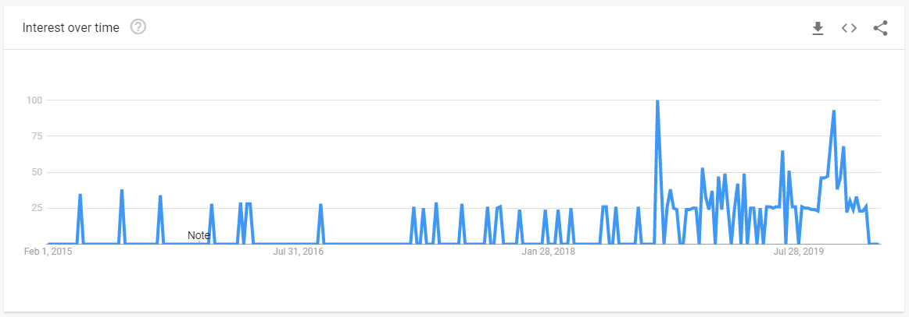
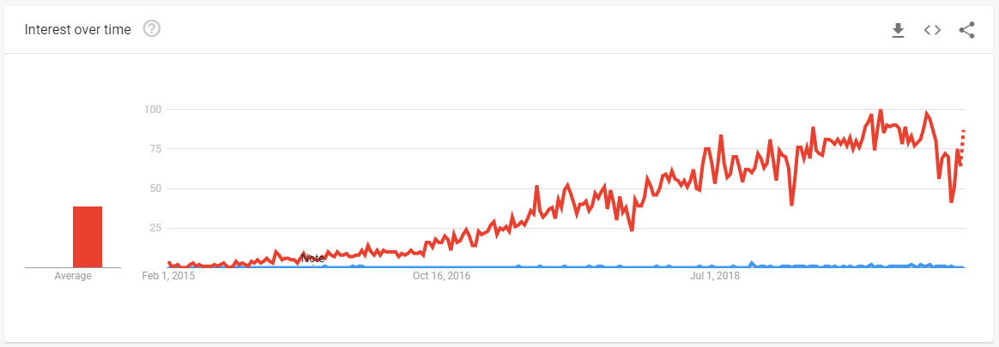

In my [previous article](/reviewing-distributed-system-architectures) we learned briefly about a somewhat new addition to the network/application protocol space called RSocket. In this article we will first set the stage, and then review some of the ways RSocket is supported in the Javascript ecosystem today.

## RSocket is young

Although Google shows search trends dating back to 2015 for RSocket, its popularity as a search term appears to have been rather stagnent until late 2018, where it started to pickup some momentum.

Why is this relevant?

If we use Google Trends as a tool/lense to determine industry adoption we can see that when compared to other protocols in the space, such  as GraphQL (denoted in red below), RSocket (denoted in blue below) has yet to experience the same boom and growth that would signify adoption.

While I do not feel that this should discourage you from evaluating RSocket for your use-case/needs, I do feel that it does represent somewhat closely the level of support and development occuring in the Javascript ecosystem for RSocket. This belief is additionally built upon a belief that the popularity and boom in adoption of GraphQL is due in part to the great support and adoption that GraphQL has found in the Javascript ecosystem. If RSocket were to gain popularity with Javacript developers, I believe it has the potential to experience similar growth in regards to adoption.

Why is any of that relevant?

....
