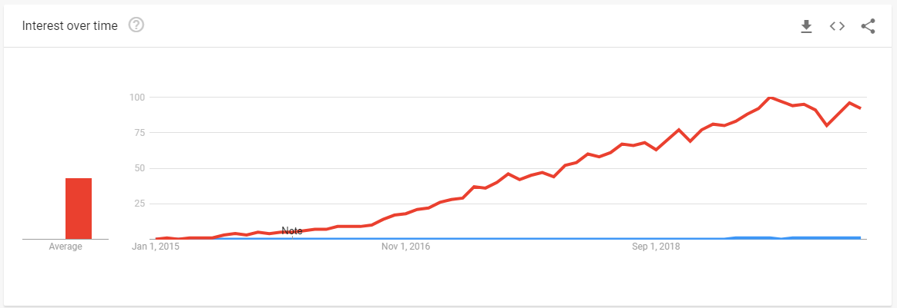

In my [previous article](/reviewing-distributed-system-architectures) we learned briefly about a somewhat new addition to the network/application protocol space called RSocket. In this article we will first set the stage, and then review some of the ways RSocket is supported in the Javascript ecosystem today.

## Setting the stage: RSocket is young

Although Google shows search trends dating back to 2015 for RSocket, its popularity as a search term appears to have been rather stagnent until late 2018, where it started to pickup some momentum.

Why is this relevant?

If we use Google Trends as a tool/lense to determine industry adoption we can see that when compared to other protocols that have gained adoption and momentum, such  as GraphQL (denoted in red below), RSocket (denoted in blue below) has yet to experience the same boom and growth that would signify a similar adoption.

In my opinion the search trend data represents somewhat closely the level of support and development occuring in the Javascript ecosystem for RSocket. I also believe that the popularity and boom in adoption of GraphQL is due in part to the great support and adoption that GraphQL has found in the Javascript ecosystem, not to mention its backing by large companies such as Facebook. If RSocket were to gain popularity with Javascript developers, and additionally gain some additional enterprise backing, I believe it has the potential to experience similar growth in regards to adoption.

Why is any of that relevant?

Javascript developers have become widely acustomed (myself included) to leveraging hundreds or thousands of open source packages to solve a wide range of problems, but that ecosystem of libraries and abstractions around RSocket hasn't quite developed just yet. So if you expect to be able to `npm install` your way to victory with RSocket, your going to have a bad time.

*[know your meme: super cool ski instructor](https://knowyourmeme.com/memes/super-cool-ski-instructor)*

## What support exists today?

Even though the open source landscape for RSocket in Javascript is relatively up and coming, there is enough to build *something* with what is currently available. And dare I say, there is likely enough to build something that you would run in production, though your mileage may vary.

### rsocket-js

[rsocket-js](https://github.com/rsocket/rsocket-js) is the primary implementation of RSocket for Javascript, which as far as I can tell was developed either in-part or solely by Facebook engineers at some point, and has received varying levels of contribution from open source contributors, as well as engineers at companies such as [Pivotal](https://pivotal.io/) and [Netifi](https://www.netifi.com/).

**Uncertain Ownership**

In contrast to the Java implementation of RSocket ([rsocket-java](https://github.com/rsocket/rsocket-java)), where investment and contribution from companies such as Netflix and Pivotal give consumers confidence and security in its continued development, I am not sure that there is a clear maintainer, owner, or history of continued development and support in regards to rsocket-js.

