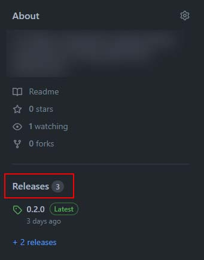
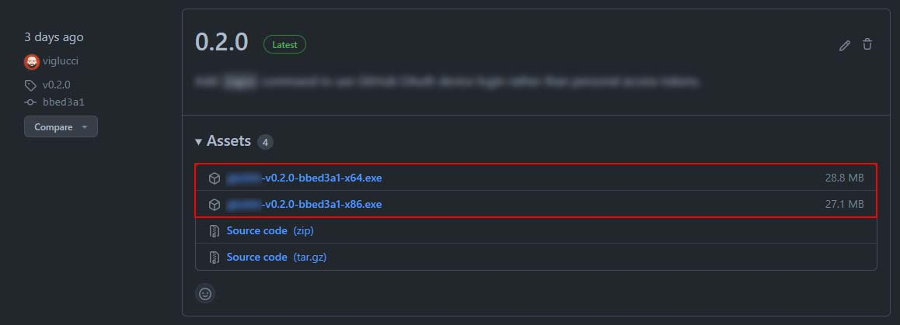

This article will provide an overview of how you can build and deploy an [oclif](https://oclif.io/) application via GitHub Actions. The pattern we will implement supports the following workflow:

- Create a release on GitHub in our projects repository
- Trigger a "build" in GitHub actions via the Release Published event
- Attach the results of the build to our release as "artifacts", allowing them to be downloaded later

## The tech involved

### oclif

"The Open CLI Framework" ([oclif](https://oclif.io/)) is a open source framework for building CLI (command line interface) applications with familiar technologies such as Node.js, JavaScript, and TypeScript.

### GitHub Actions

[GitHub actions](https://docs.github.com/en/actions) is a CI/CD solution provided directly from GitHub that allows you to run automation tasks based on various "events" that occur on repositories hosted on github.com.

## Releasing a oclif application

oclif is especially appealing when you wish to produce binaries that will work natively on multiple operating systems. This support is provided through a number of commands available on the `oclif` CLI. You can learn about this in more detail in the ["Release"](https://oclif.io/docs/releasing) section on the oclif documentation website, but we'll give a brief overview of the strategies below.

### NPM

Because oclif is built around node.js and npm, an oclif app can be published directly to npm using the standard `npm publish` command. This strategy allows existing node.js and npm users to easily install your application globally using the `npm install -g <app_name>` command.

For public projects, or projects where the target user base is expected to already have node.js and npm installed, this strategy is likely sufficient and the most straight forward. Where this strategy will not be as appealing is when you do not intend to distribute your application publicly, or users can not be expected to have already installed node.js and npm.

### Standalone Tarballs

For projects where you can not expect users to install node.js and npm, oclif provides functionality for producing builds that will output as standalone tarballs, and the standalone tarball builds can be produced for multiple supported operating systems. For the sake of this article, we will be working to produce an installable Windows executable.

## Building with GitHub Actions

GitHub actions are capable of running tasks and commands on a repository in response to events. One of the events that is possible to target is the "release published" event, which is what we will use to kick off our workflow.

### GitHub Releases

Releases on GitHub allow maintainers to communicate meaningful milestones for their project, as well as distribute "artifacts" related to those milestones. For our example, we will be creating a new Windows installer for our CLI application, and attaching it to the desired release as an "artifact".

To view the releases for a repository on GitHub, you can visit the releases page at `github.com/REPOSITORY_NAME/releases`, or click the "releases" header on the repositories index page.

#### Releases header

The releases header can difficult to find, so I've provided an example below.



### Create the workflows file

To get started, we need to first ensure that we have a `.github/workflows` directory created in our repositories root directory.

example: `project-folder/.github/workflows`

Next, inside of the `.github/workflows` directory create a `release.yml` directory. This yaml file is where we will configure our "actions" that will run in response to the events on our repository.

example: `project-folder/.github/workflows/release.yml`

### Setup event triggers

```yml
# .github/workflows/release.yml

on:
  release:
    types: [published]

...
```

This configuration will trigger our workflow anytime a new release is published on the repository.

### Configure jobs

```yml
# .github/workflows/release.yml

...

jobs:
  release:
    name: release ${{ matrix.target }}
    runs-on: ubuntu-latest

    strategy:
      fail-fast: false
      matrix:
        include:
          - target: win
            artifact_glob: "./dist/win32/*"

...
```

This configuration provides a few bits of functionality to our workflow:

- Creates a list of ["jobs"](https://docs.github.com/en/actions/using-jobs/using-jobs-in-a-workflow) that will run when our workflow triggers
- Defines that the job should run on and use the latest "ubuntu-latest" image as a base
- Defines a "strategy" which allows us to further define variables that we can reference later


#### Strategy matrix variables

The `strategy.matrix` is a special configuration that allows for running workflow jobs with a combination of variables. This is generally useful if you wish to run the same set of tasks with different variables, such as versions of dependencies, or to produce specific outputs for different environments.

For our purposes, we are using a `strategy.matrix` that targets a Windows build, but could be extended with additional entries to target other platforms.

You can learn more about matrix configurations [here](https://docs.github.com/en/actions/using-jobs/using-a-build-matrix-for-your-jobs).

### Steps

Last we will configure the "steps" that will be run when our job is executed.

```yml
# .github/workflows/release.yml

...

    steps:
    - run: sudo apt update
    - run: sudo apt install nsis p7zip-full p7zip-rar -y
    - uses: actions/checkout@v2
    - uses: actions/setup-node@v2
      with:
        node-version: '16'
    - run: npm install -g yarn
    - run: yarn
    - run: yarn global add oclif
    - run: oclif pack ${{ matrix.target }} -r .
    - name: Attach artifacts to release
      uses: svenstaro/upload-release-action@v2
      with:
        repo_token: ${{ secrets.GITHUB_TOKEN }}
        file: ${{ matrix.artifact_glob }}
        file_glob: true
        overwrite: true
        tag: ${{ github.ref }}
```

The steps breakdown is as follows:

 1. `run: sudo apt update`
    - Updates the libraries already installed on the `ubuntu-latest` base image to ensure we have the latest and greatest
 2. `run: sudo apt install nsis p7zip-full p7zip-rar -y`
    - Installs several dependencies which are required to package our application as a Windows installer using `makensis`.
 3. `uses: actions/checkout@v2`
    - Uses a prebuilt GitHub action to checkout our project source code
 4. `uses: actions/setup-node@v2`
    - Sets up node.js and npm, specifically using version `16` of node.js
 5. `run: npm install -g yarn`
    - Installs `yarn` globally so we can use it in later commands
 6. `run: yarn`
    - Calls `yarn` to install our dependencies listed in `package.json`
 7. `run: yarn global add oclif`
    - Installs the `oclif` CLI globally via `yarn`
 8. `run: oclif pack ${{ matrix.target }} -r .`
    - Calls the `oclif` CLI to package our application using the "target" we previously defined in our matric config
    - example: `oclif pack win -r .` will package for Windows
 9. `uses: svenstaro/upload-release-action@v2`
    - Uses a prebuilt GitHub action ([svenstaro/upload-release-action@v2](https://github.com/svenstaro/upload-release-action)) to attach the artifacts from the `oclif pack` command onto the GitHub release with the tag denoted by `tag: ${{ github.ref }}`
    - Notice the `file` attribute with the value `matrix.artifact_glob`? This value references the variable we originally defined in our `matrix` configuration. Practically speaking, this will result in every file in the `/dist/win32/` directory being attached to the GitHub release.

### Putting it all together

Below is an example of the entire `release.yml` file.

```yml
# .github/workflows/release.yml

on:
  release:
    types: [published]

jobs:
  release:
    name: release ${{ matrix.target }}
    runs-on: ubuntu-latest
    strategy:
      fail-fast: false
      matrix:
        include:
          - target: win
            artifact_glob: "./dist/win32/*"
    steps:
    - run: sudo apt update
    - run: sudo apt install nsis p7zip-full p7zip-rar -y
    - uses: actions/checkout@v2
    - uses: actions/setup-node@v2
      with:
        node-version: '16'
    - run: npm install -g yarn
    - run: yarn
    - run: yarn global add oclif
    - run: oclif pack ${{ matrix.target }} -r .
    - name: Attach artifacts to release
      uses: svenstaro/upload-release-action@v2
      with:
        repo_token: ${{ secrets.GITHUB_TOKEN }}
        file: ${{ matrix.artifact_glob }}
        file_glob: true
        overwrite: true
        tag: ${{ github.ref }}
```
This article will provide an overview of how you can build and deploy an [oclif](https://oclif.io/) application via GitHub Actions. The pattern we will implement supports the following workflow:

- Create a release on GitHub in our project's repository
- Trigger a "workflow" in GitHub actions via the Release Published event
- Attach the results of the workflow to our release as "artifacts," allowing them to be downloaded later

## A quick overview

### oclif

"The Open CLI Framework" ([oclif](https://oclif.io/)) is an open-source framework for building CLI (command-line interface) applications with standard technologies such as Node.js, JavaScript, and TypeScript.

### GitHub Actions

[GitHub actions](https://docs.github.com/en/actions) is a CI/CD solution provided directly from GitHub that allows you to run automation tasks based on various "events" that occur on repositories hosted on github.com.

## Releasing an oclif application

oclif is especially appealing when you wish to produce binaries that will work natively on multiple operating systems. This support is provided through several commands available on the `oclif` CLI. You can learn about this in more detail in the ["Release" section](https://oclif.io/docs/releasing) on the oclif documentation website. Still, we'll give a brief overview of the strategies below.

### NPM

Because oclif is built around node.js and npm. An oclif app can be published directly to npm using the standard `npm publish` command. This strategy allows existing node.js and npm users to easily install your application globally using the `npm install -g <app_name>` command.

This strategy is likely sufficient and the most straightforward for public projects or projects where the target user base is expected to have node.js and npm installed.

### Standalone Tarballs

For projects where you can not expect users to install node.js and npm, oclif provides functionality for producing builds that will output standalone tarballs. Standalone tarball builds can be created for multiple supported operating systems. For the sake of this article, we will be working to produce an installable Windows executable. Still, you can review the complete list in the ["Release" section](https://oclif.io/docs/releasing) on the oclif documentation website.

## Building with GitHub Actions

GitHub actions can run tasks and commands on a repository in response to events. One of the possible events is the "release published" event, which we will use to trigger our workflow.

### GitHub Releases

Releases on GitHub allow maintainers to communicate meaningful milestones for their projects and distribute "artifacts" related to those milestones. For our example, we will be creating a new Windows installer for our CLI application and attaching it to the desired release as an "artifact."

To view the releases for a repository on GitHub, you can visit the releases page at `github.com/REPOSITORY_NAME/releases` or click the "releases" header on the repositories index page.

#### Releases header

The releases header can be challenging to find, so I've provided an example below.


### Create the workflows file

To get started, we need to ensure that we have a `.github/workflows` directory created in our repositories root directory.

example: `project-folder/.github/workflows`

Next, inside the `.github/workflows` directory, create a `release.yml` directory. This YAML file will configure our "actions" that will run in response to the events on our repository.

example: `project-folder/.github/workflows/release.yml`

### Setup event triggers

"`yml
# .github/workflows/release.yml

on:
  release:
    types: [published]

...
```

This configuration will trigger our workflow anytime a new release is published on the repository.

### Configure jobs

"`yml
# .github/workflows/release.yml

...

jobs:
  release:
    name: release ${{ matrix.target }}
    runs-on: ubuntu-latest

    strategy:
      fail-fast: false
      matrix:
        include:
          - target: win
            artifact_glob: "./dist/win32/*"

...
```

This configuration provides a few bits of functionality to our workflow:

- Creates a list of ["jobs"](https://docs.github.com/en/actions/using-jobs/using-jobs-in-a-workflow) that will run when our workflow triggers
- Defines that the job should run on and use the latest "ubuntu-latest" image as a base
- Defines a "strategy," which allows us to define further variables that we can reference later


#### Strategy matrix variables

The `strategy.matrix` is a configuration that allows for running workflow jobs with a combination of variables. Matrix is generally helpful if you wish to run the same set of tasks with different variables, such as versions of dependencies, or to produce specific outputs for different environments.

For our purposes, we are using a `strategy.matrix` that targets a Windows build but could be extended with additional entries to target other platforms.

You can learn more about matrix configurations [here](https://docs.github.com/en/actions/using-jobs/using-a-build-matrix-for-your-jobs).

### Steps

Last we will configure the "steps" that will be run when our job is executed.

"`yml
# .github/workflows/release.yml

...

    steps:
    - run: sudo apt update
    - run: sudo apt install nsis p7zip-full p7zip-rar -y
    - uses: actions/checkout@v2
    - uses: actions/setup-node@v2
      with:
        node-version: '16'
    - run: npm install -g yarn
    - run: yarn
    - run: yarn global add oclif
    - run: oclif pack ${{ matrix.target }} -r .
    - name: Attach artifacts to release
      uses: svenstaro/upload-release-action@v2
      with:
        repo_token: ${{ secrets.GITHUB_TOKEN }}
        file: ${{ matrix.artifact_glob }}
        file_glob: true
        overwrite: true
        tag: ${{ github.ref }}
```

The steps breakdown is as follows:

 1. `run: sudo apt update`
    - Updates the libraries already installed on the `ubuntu-latest` base image to ensure we have the latest and greatest
 2. `run: sudo apt install nsis p7zip-full p7zip-rar -y'
    - Installs several dependencies required to package our application as a Windows installer using `makensis`.
 3. `uses: actions/checkout@v2`
    - Uses a prebuilt GitHub action to checkout our project source code
 4. `uses: actions/setup-node@v2`
    - Sets up node.js and npm, specifically using version `16` of node.js
 5. `run: npm install -g yarn`
    - Installs `yarn` globally so we can use it in later commands
 6. `run: yarn`
    - Calls `yarn` to install our dependencies listed in `package.json`
 7. `run: yarn global add oclif`
    - Installs the `oclif` CLI globally via `yarn`
 8. `run: oclif pack ${{ matrix.target }} -r .`
    - Calls the `oclif` CLI to package our application using the "target" we previously defined in our matric config
    - example: `oclif pack win -r .` will package for Windows
 9. `uses: svenstaro/upload-release-action@v2`
    - Uses a prebuilt GitHub action ([svenstaro/upload-release-action@v2](https://github.com/svenstaro/upload-release-action)) to attach the artifacts from the `oclif pack` command onto the GitHub release with the tag denoted by `tag: ${{ github.ref }}`
    - Notice the `file` attribute with the value `matrix.artifact_glob`? This value references the variable we originally defined in our `matrix` configuration. Practically speaking, this will result in every file in the `/dist/win32/` directory being attached to the GitHub release.

### Putting it all together

Below is an example of the entire `release.yml` file.

"`yml
# .github/workflows/release.yml

on:
  release:
    types: [published]

jobs:
  release:
    name: release ${{ matrix.target }}
    runs-on: ubuntu-latest
    strategy:
      fail-fast: false
      matrix:
        include:
          - target: win
            artifact_glob: "./dist/win32/*"
    steps:
    - run: sudo apt update
    - run: sudo apt install nsis p7zip-full p7zip-rar -y
    - uses: actions/checkout@v2
    - uses: actions/setup-node@v2
      with:
        node-version: '16'
    - run: npm install -g yarn
    - run: yarn
    - run: yarn global add oclif
    - run: oclif pack ${{ matrix.target }} -r .
    - name: Attach artifacts to release
      uses: svenstaro/upload-release-action@v2
      with:
        repo_token: ${{ secrets.GITHUB_TOKEN }}
        file: ${{ matrix.artifact_glob }}
        file_glob: true
        overwrite: true
        tag: ${{ github.ref }}
```

## Conclusion

Once you have added the above GitHub Action workflow file to your repository, future published releases will trigger a new build. The produced artifacts will be attached to the release.



Note: Ensure that you tag your releases with a new Git tag, and add the appropriate tag to your release, as these tags are required by the *svenstaro/upload-release-action@v2* action. Tagging your release is as easy as using the [npm version](https://docs.npmjs.com/cli/v8/commands/npm-version) or [yarn version](https://classic.yarnpkg.com/en/docs/cli/version) commands.

The Windows target executable will install the CLI via a standard Windows install flow and is downloadable directly from the release page.